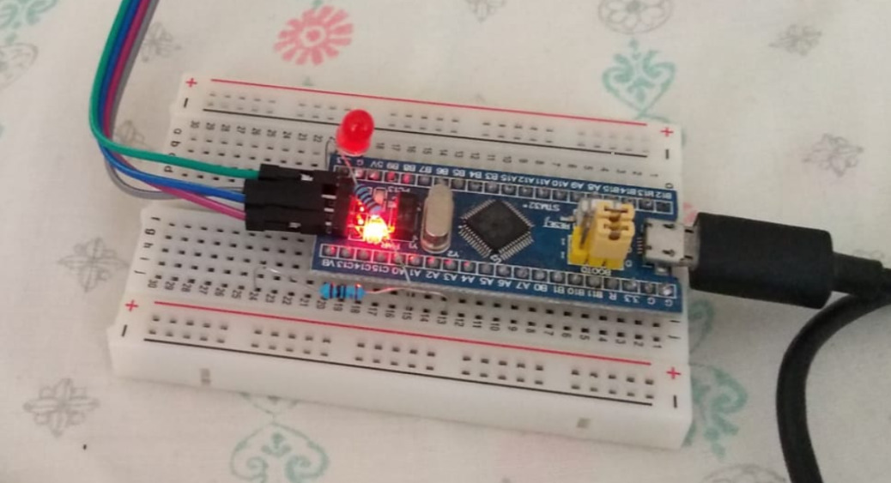
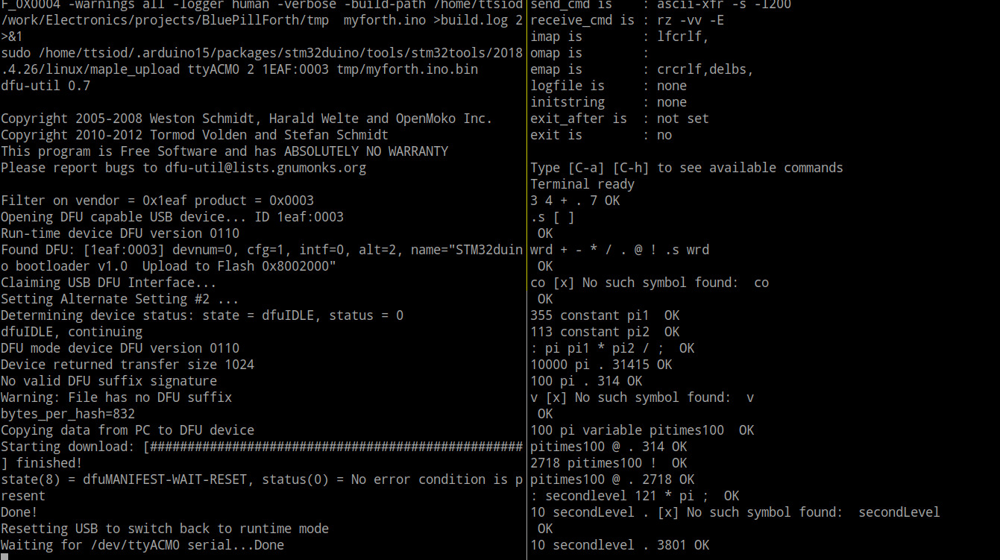

*( Wrote [a blog post about this here](https://www.thanassis.space/miniforth.html) )*

It was raining hard, a week ago.

And what could you possibly do on a rainy Saturday afternoon?

Well...

You can make a Forth interpreter/compiler from scratch...  
...then put it inside a 1.5$ Blue Pill microcontroller...  
...and finally, inside an Arduino UNO...  
... within its tiny 2K RAM!

I haven't done anything even *remotely* close to this in decades...  
I *loved* building it.

The rainy afternoon turned into a week-long hackfest *(was looking
forward every day to the post-work FORTH-tinkering in the afternoon...)*

The result: a tiny, mini, micro Forth. In portable C++ :-) 
It has...

- basic arithmetic
- star-slash (double-word accurate muldiv)
- literals
- constants
- variables
- string printing
- reseting
- comments
- nested DO/LOOP
- comparisons
- nested IF/ELSE/THEN
- ...and of course, functions (Forth words)

Here's an ascii-cast recording of it in action:

Read the test scenario below to see my supported Forth constructs.

# Portability, ArduinoSTL and Valgrind/AddressSanitizer checks

I meant it when I said "portable". Part of my reasoning was that
I wanted to be able to use Valgrind and AddressSanitizer to detect
any issues I have with my memory handling. 

But what about the embedded targets? BluePill and Arduino UNO?

I tried ArduinoSTL, but it was too wasteful memory-wise; and it
made the build process significantly slower as well. I therefore
built my own [memory pool, as well as list, tuple and string-like C++ templates](https://github.com/ttsiodras/MiniForth/tree/master/src/mini_stl.h).

It was a nice challenge, re-inventing a tiny C++ STL.  
And I understand STL a lot better now, after building small pieces of it myself :-)

# Simulation / Debugging

I quickly setup simulation via [simavr](https://github.com/buserror/simavr.git).
This tremendously improved my developing speed, since a simulator
spawns and runs much faster than the real board. Due to the code
being portable, debugging took place mostly in the host GDB;
and after Valgrind and AddressSanitizer gave their blessing, I usually
found out that the simulator (and the real board) worked fine as well.

# BluePill vs Arduino UNO

Thanks to ArduinoSTL, it was easy to run inside the BluePill. The 1.5$
mini-monster has 10 times more SRAM than an Arduino UNO; so I reached
a fully functioning point in a couple of days, and placed the code
in a [separate branch](https://github.com/ttsiodras/MiniForth/tree/BluePill-STM32F103C).

But as said above, that wasn't nearly enough to make it work in my
Arduino UNO. I had to work more for that (see below).

As for the BluePill, it should be said that for my embedded targets,
I always want a development workflow that is based on normal bootloaders;
not programmers.  I therefore burned the
[stm32duino](https://github.com/rogerclarkmelbourne/STM32duino-bootloader)
bootloader on the BluePill, which allowed me to easily program it
in subsequent iterations via the USB connection (and a simple `make upload`).

The same USB connection would then function as a serial port immediately
afterwards - allowing me to interact with the newly uploaded Forth in the
BluePill.

The screenshot below is from a `tmux`: on the left, the output from `make upload`;
and on the right, I use `picocom` to interact with my mini-Forth
over the serial port:

# Memory - the final frontier

The ArduinoSTL was not enough for the Arduino UNO.  
I kept running out of memory...

So I built my own [mini-STL](https://github.com/ttsiodras/MiniForth/tree/master/src/mini_stl.h),
and tightly controlled all memory utilisation.

I also used macro-magic to move all strings to Flash at compile-time
(see `dprintf` in the code)... And saved memory everywhere I could,
even re-using error messages across various members.

Nothing flexes your coding muscles as much as optimising; whether it is
for speed or for space. See the implementation of ".S" for example,
where the (obvious) stack reversal code is also the most wasteful...
Changing it to a slower but memory-preserving algorithm allowed me
to use ".S" even when almost all my memory is full.

# C++ vs C

I know that many developers hate C++. I even wrote a
[blog post](https://www.thanassis.space/cpp.html) about it.

And I understand why - they see code like this...

    #include "mini_stl.h"
    
    template<class T>
    typename forward_list<T>::box *forward_list<T>::_freeList = NULL;
    
...and they start screaming - "what the hell is that", "incomprehensible
madness", etc.

But there are very important benefits in using C++ - and templates 
in particular. You write less code, with no additional run-time or
memory overhead compared to C, and with a lot more compile-time checks
that watch your back (for things that would otherwise blow up in your face).

See my Optional<T> for example, that emulates (badly) the optional
type of Rust/OCaml/F#/Scala/Kotlin etc. It **forces** you to check
your returned error codes:

    Optional<int> Forth::needs_a_number(const __FlashStringHelper *msg)
    {
        if (_stack.empty())
            return error(emptyMsgFlash, msg);
        auto topVal = *_stack.begin();
        if (topVal._kind == StackNode::LIT)
            return topVal._u.intVal;
        else
            return FAILURE;
    }

You can't "forget" to check the potential for a failure coded inside 
your returned value - because your code has to "unwrap" it. I could have
done this better, but I chose to implement it via simple tuples
(this was a one-weeks-afternoons hack, after all :-)

As for the template "magic" incantation above - it *is* true magic: My
`forward_list` template is using free-lists to store the `pop_front`-ed
elements and reuse them in subsequent allocations. I wanted these free-lists to
be global (i.e. static members) because lists of the same type must re-use a
single, commonly-shared free-list. The magic spell tells the compiler I want to
instantiate these globals *once*, for each type T that I use in any 
lists in my code.

# My Forth test scenario - including a FizzBuzz!

Yep, FizzBuzz - we are fully Turing complete. And would surely pass
Joel's interview :-)

    ." Reset... " RESET
    ." Check comments... " \ Yes, we support the new-style comments :-)
    ." Computing simple addition of 3 + 4... " 3 4 + .
    ." Is 1 = 2 ?... " 1 2 = .
    ." Is 1 > 2 ?... " 1 2 > .
    ." Is 1 < 2 ?... " 1 2 < .
    ." Define pi at double-word precision... " : pi 355 113 */ ;
    ." Use definition to compute 10K times PI... " 10000 pi .
    ." Check: 23 mod 7... " 23 7 MOD .
    ." Defining 1st level function1... " : x2 2 * ;
    ." Defining 1st level function2... " : p4 4 + ;
    ." 2nd level word using both - must print 24... " 10 x2 p4 . 
    ." Defining a variable with value 123... " 123 variable ot3
    ." Printing variable's value... " ot3 @ .
    ." Defining The Constant (TM)... " 42 constant lifeUniverse
    ." Printing The Constant (TM)... " lifeUniverse .
    ." Setting the variable to The Constant (TM)... " lifeUniverse ot3 !
    ." Printing variable's value... " ot3 @ .
    ." Setting the variable to hex 0x11... " $11 ot3 !
    ." Printing variable's value... " ot3 @ .
    ." Defining helper... " : p5 5 U.R . ;
    ." Defining 3 times loop... " : x3lp 3 0 DO I p5 LOOP ;
    ." Calling loop... " x3lp
    ." Defining loop calling loop 2 times... " : x6lp 2 0 DO x3lp LOOP ;
    ." Nested-looping 2x3 times... " x6lp
    ." Inline: " : m 3 1 DO 3 1 DO CR J p5 I p5 ." = " J I * p5 LOOP LOOP ;
    ." Use inline loops with two indexes... " m
    ." Make multiples of 7 via DUP... " : m7s 10 0 DO DUP I * . LOOP DROP ;
    ." Print them and DROP the 7... " 7 m7s
    ." Reset... " RESET
    \ Time for Turing completeness...
    ." Let's do Fizz-Buzz! " \ Turing Completeness check...
    \ fizz ( n -- 0_or_1 n )
    ." Define fizz... " : fizz DUP 3 MOD 0 = IF ." fizz " 1 ELSE 0 THEN SWAP ;
    \ buzz ( n -- 0_or_1 n )
    ." Define buzz... " : buzz DUP 5 MOD 0 = IF ." buzz " 1 ELSE 0 THEN SWAP ;
    \ emitNum ( 0_or_1 0_or_1 n -- )
    ." Define emitNum... " : emitNum ROT ROT + 0 = if . ELSE DROP THEN ;
    \ mainloop ( n -- )
    ." Define mainloop... " : mainloop fizz buzz emitNum ;
    \ fb ( -- )
    ." Define fizzbuzz... " : fb 37 1 DO I mainloop LOOP ;
    ." Run it! " fb
    ." Report memory usage... " .S
    ." All done! "

# Automation

I am a strong believer in automation. The final form of my `Makefile`
therefore has many rules - e.g. `make arduino-sim` - that automate
various parts of the workflow.

Here's what they do:

- **arduino**: Compiles the code for Arduino UNO - builds `src/tmp/myforth.ino.{elf,hex}`

- **arduino-sim**: After building, launches the compiled mini-Forth in `simduino`.

- **upload**: After building, uploads to an Arduino attached to the port
	      configured inside `config.mk`.

- **terminal**: After uploading, launches a `picocom` terminal with
	        all appropriate settings to interact with my Forth.

- **x86**: Builds for x86. Actually, should easily build for any native target (ARM, etc).

- **test-address-sanitizer**: Uses the x86 binary to test the code, executing
	all steps of the scenario shown above. The binary is built with the
	address sanitizer enabled (to detect memory issues).

- **test-valgrind**: Same, but with Valgrind.

- **test-simulator**: Spawns `simavr` and sends the entire test scenario shown
	              above to it - while showing the responses received from it.

- **test-arduino**: Sends the entire test scenario shown above to an
	            Arduino Uno connected to the port specified in `config.mk`
	            and shows the responses received over that serial port.

Another example of automation - the complete test scenario shown in the 
previous section, is not just an example in the documentation; it is 
extracted automatically from this README and fed into the Valgrind and
AddressSanitizer tests... and also into the Python testing script that
sends the data to the board in real-time.

[DRY](https://en.wikipedia.org/wiki/Don%27t_repeat_yourself), folks.

# Conclusion

I thoroughly enjoyed building this. I know full well that Forths are not
supposed to be built in C++; they are supposed to be built in assembly,
and also, utilise the Flash to store the user-compiled code at run-time.

But that wasn't the point of this - the point was to have fun and learn Forth.  
And what better way to learn a language than to actually implement it! :-)

And... as a child of the 80s...  I now know first-hand what
[Jupiter Ace](https://en.wikipedia.org/wiki/Jupiter_Ace) was about :-)

Fork the code, and enjoy tinkering with it!  
Thanassis.
